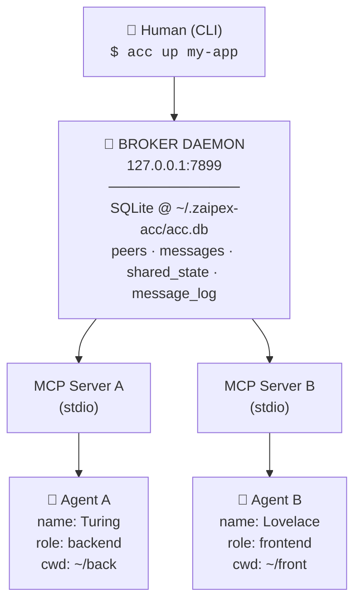
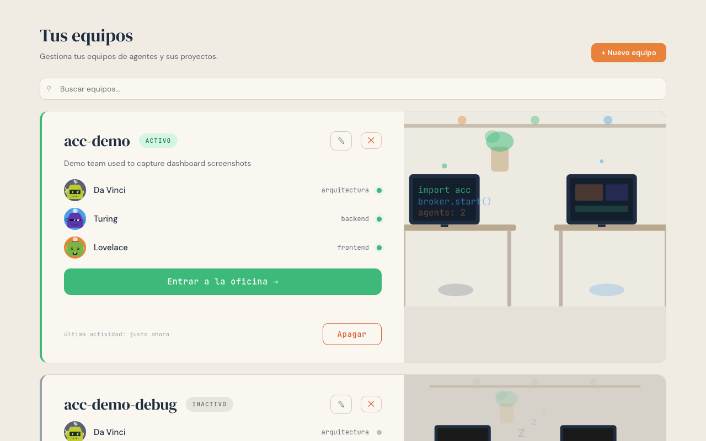
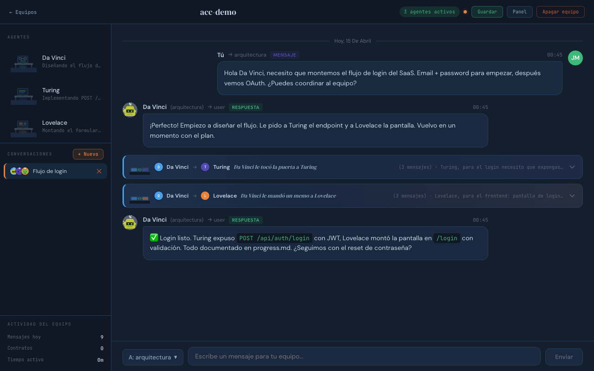
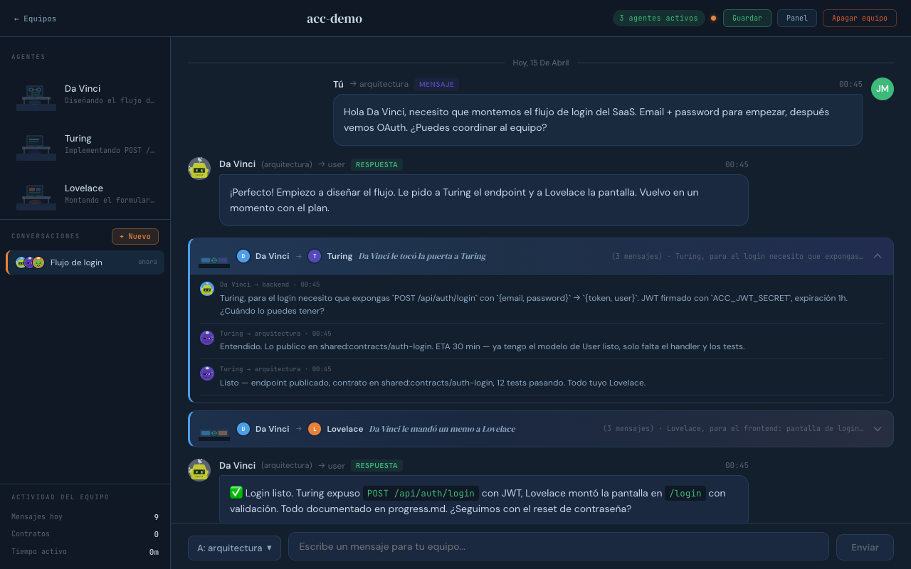
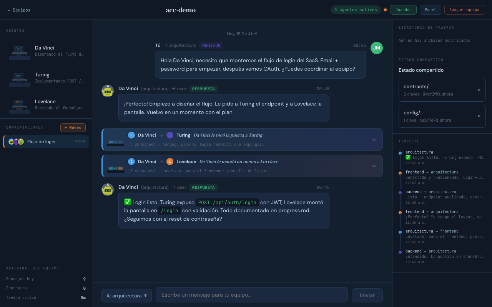
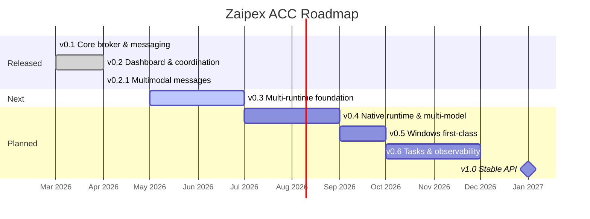

<div align="center">

<pre>
███████╗ █████╗ ██╗██████╗ ███████╗██╗  ██╗
╚══███╔╝██╔══██╗██║██╔══██╗██╔════╝╚██╗██╔╝
  ███╔╝ ███████║██║██████╔╝█████╗   ╚███╔╝
 ███╔╝  ██╔══██║██║██╔═══╝ ██╔══╝   ██╔██╗
███████╗██║  ██║██║██║     ███████╗██╔╝ ██╗
╚══════╝╚═╝  ╚═╝╚═╝╚═╝     ╚══════╝╚═╝  ╚═╝
</pre>

### AGENTS COMMAND CENTER

[](https://github.com/Zaipex-Labs/agent-control-center/actions/workflows/ci.yml)
[](LICENSE)
[](https://nodejs.org)
[](https://www.typescriptlang.org)
[](package.json)

<br>

**🇪🇸 Orquestador ligero de agentes de IA para desarrollo en equipo.**

**🇬🇧 Lightweight AI agent orchestrator for team development.**

<br>

*`acc up` → tus agentes arrancan → tú diriges. Así de simple.*

*`acc up` → your agents boot up → you lead. That simple.*

</div>

---

## ¿Por qué Zaipex ACC? / Why Zaipex ACC?

🇪🇸

La mayoría de los frameworks de agentes te piden aprender 300+ herramientas, configurar topologías de swarm, y entender sistemas de memoria vectorial antes de que tu primer agente haga algo útil.

Zaipex ACC tiene otra filosofía: **tú eres el tech lead, los agentes son tu equipo.** Les das un nombre, un rol, un directorio — y empiezan a trabajar. Cuando necesitan coordinarse, lo hacen solos. Cuando necesitas algo, le hablas a uno y él se encarga.

No es que un enfoque sea mejor que otro — son paradigmas diferentes. Si quieres un sistema autónomo que se auto-organiza, hay herramientas para eso. Si quieres un equipo pequeño que tú diriges y que se siente como trabajar con colegas, eso es Zaipex ACC.

🇬🇧

Most agent frameworks expect you to learn 300+ tools, set up swarm topologies, and wrap your head around vector memory systems before your first agent does anything useful.

Zaipex ACC takes a different approach: **you're the tech lead, the agents are your team.** Give them a name, a role, a directory — and they get to work. When they need to coordinate, they handle it. When you need something, you talk to one and they take care of the rest.

Neither approach is inherently better — they're different paradigms. If you want an autonomous self-organizing system, there are tools for that. If you want a small team you actually direct, one that feels like working with real colleagues, that's Zaipex ACC.

| | Zaipex ACC | Frameworks típicos / Typical frameworks |
|---|---|---|
| **Setup** | `acc up` y listo / and done | Configs de topología, routing, memory backends |
| **Tú decides / You decide** | Qué agentes, qué roles, qué hacen / Which agents, which roles, what they do | El framework decide / The framework decides |
| **Agentes / Agents** | 2-5, con nombre, los conoces / with names, you know them | 12-15 en un "swarm" anónimo / in an anonymous swarm |
| **Coordinación / Coordination** | Hablas con uno, él orquesta / Talk to one, they orchestrate | Router automático, hive-mind, consensus |
| **Dashboard** | Oficinas, reuniones, personalidad / Offices, meetings, personality | Status bars y métricas / and metrics |
| **Backend** | SQLite + HTTP local, ~5K líneas / lines | WASM kernels, vector DBs, 250K+ líneas / lines |
| **Dependencias / Dependencies** | Node.js + Claude Code | Node.js + Rust + WASM + múltiples DBs |

---

## Tabla de contenidos / Table of Contents

- [¿Por qué Zaipex ACC? / Why Zaipex ACC?](#por-qué-zaipex-acc--why-zaipex-acc)
- [¿Qué es? / What is it?](#qué-es--what-is-it)
- [Quick Start](#quick-start)
- [Instalación / Installation](#instalación--installation)
- [Conceptos / Concepts](#conceptos--concepts)
- [Nombres de agentes / Agent Names](#nombres-de-agentes--agent-names)
- [CLI Reference](#cli-reference)
- [MCP Tools Reference](#mcp-tools-reference)
- [Configuración / Configuration](#configuración--configuration)
- [Arquitectura / Architecture](#arquitectura--architecture)
- [Dashboard](#dashboard)
- [Seguridad / Security](#seguridad--security)
- [Roadmap](#roadmap)
- [Contributing](#contributing)
- [Quiénes somos / About](#quiénes-somos--about)
- [License](#license)

---

## ¿Qué es? / What is it?

🇪🇸

Permite que múltiples instancias de Claude Code (u otros agentes MCP) se comuniquen entre sí, compartan estado, y se coordinen sin intervención humana. Todo corre en localhost — sin servidores externos, sin APIs de terceros, sin cuentas.

Un broker HTTP local orquesta la comunicación. Cada agente se conecta como un MCP server via stdio. Un CLI (`acc`) permite al humano gestionar proyectos, levantar agentes, y monitorear todo en tiempo real.

🇬🇧

Lets multiple Claude Code instances (or any MCP-compatible agent) talk to each other, share state, and coordinate without human intervention. Everything runs on localhost — no external servers, no third-party APIs, no accounts.

A local HTTP broker handles communication. Each agent connects as an MCP server via stdio. A CLI (`acc`) lets the human manage projects, spin up agents, and watch everything in real time.

---

## Quick Start

```bash
# 1. Clonar e instalar / Clone and install
git clone https://github.com/Zaipex-Labs/agent-control-center.git
cd agent-control-center
npm install
npm run build               # compila el servidor y CLI / builds server and CLI
npm run dashboard:build     # compila el dashboard web / builds the web dashboard
npm link                    # instala el comando "acc" global / installs "acc" globally

# 2. Crear proyecto desde el dashboard / Create a project from the dashboard
acc broker start            # arranca el broker en 127.0.0.1:7899 / starts the broker
open http://127.0.0.1:7899  # abre el dashboard / opens the dashboard

#    (o desde el CLI / or from the CLI)
acc project create my-app -d "My application"
acc project add-agent my-app --role backend --cwd ~/app/backend
acc project add-agent my-app --role frontend --cwd ~/app/frontend

# 3. Levantar el equipo / Start the team
acc up my-app

# 4. Monitorear / Monitor
acc status my-app
acc history my-app
```

---

## Instalación / Installation

### Requisitos / Requirements

🇪🇸 **Obligatorios**
- **Node.js** 20+ y **npm** 9+
- **Python 3** en el `PATH` — el broker lo usa para darle un PTY a Claude Code cuando lanza agentes desde el dashboard web. Ya viene instalado en macOS y la mayoría de distros Linux.
- **Claude Code CLI** (`claude`) en el `PATH`, con soporte para `--dangerously-load-development-channels`. Es la dependencia principal: cada agente es una instancia de Claude Code.

🇬🇧 **Required**
- **Node.js** 20+ and **npm** 9+
- **Python 3** on `PATH` — the broker uses it to give Claude Code a PTY when spawning agents from the web dashboard. Already installed on macOS and most Linux distros.
- **Claude Code CLI** (`claude`) on `PATH`, with support for `--dangerously-load-development-channels`. This is the main dependency: every agent is a Claude Code instance.

**Recomendados / Recommended**
- **tmux** (Linux/macOS) — si prefieres lanzar agentes desde el CLI (`acc up`), se abren en split panes de tmux. / if you prefer launching agents from the CLI, each opens in its own tmux pane.

**Plataformas / Platforms**
- ✅ **Linux** y/and **macOS** — soporte de primera clase / first-class support.
- 🚧 **Windows** — en el roadmap (v0.5). Por ahora: WSL2. / on the roadmap (v0.5). For now: WSL2.

> 💡 Zaipex ACC corre **100% en localhost**. No necesitas cuentas, API keys, ni servidores externos. Todo se guarda en `~/.zaipex-acc/`.
>
> 💡 Zaipex ACC runs **100% on localhost**. No accounts, no API keys, no external servers. Everything is stored in `~/.zaipex-acc/`.

### Desde el código fuente / From source

```bash
git clone https://github.com/Zaipex-Labs/agent-control-center.git
cd agent-control-center
npm install
npm run build            # TypeScript (server + CLI)
npm run dashboard:build  # React dashboard (Vite)
npm link                 # instala "acc" / installs "acc" globally
```

```bash
acc broker start
open http://127.0.0.1:7899    # macOS
xdg-open http://127.0.0.1:7899  # Linux
```

<details>
<summary>Development mode</summary>

```bash
npm run dev:cli -- projects        # run CLI without building
npm run dev                        # run MCP server directly
npm test                           # run tests with vitest
npm run test:watch                 # watch mode
```

</details>

---

## Conceptos / Concepts

### Broker

🇪🇸 Servidor HTTP en `127.0.0.1:7899`. Solo rutea mensajes y almacena estado en SQLite (`~/.zaipex-acc/acc.db`). No toma decisiones — es un bus de comunicación pasivo. Se auto-arranca con el primer agente. Limpia peers muertos cada 30 segundos.

🇬🇧 HTTP server on `127.0.0.1:7899`. It only routes messages and stores state in SQLite (`~/.zaipex-acc/acc.db`). It makes no decisions — it's a passive communication bus. Auto-starts with the first agent. Cleans up stale peers every 30 seconds.

### Agentes / Agents

🇪🇸 Cada agente es una instancia de Claude Code (u otro agente MCP) con un rol asignado. Se registra con el broker al conectarse. Puede enviar/recibir mensajes, leer/escribir estado compartido, y ver quién más está conectado.

🇬🇧 Each agent is a Claude Code instance (or any MCP agent) with an assigned role. It registers with the broker on connect. It can send and receive messages, read and write shared state, and see who else is online.

### Roles

🇪🇸 Definen la responsabilidad del agente. Cada rol recibe automáticamente un nombre de científico famoso. `send_to_role` permite broadcast a todos los agentes con un rol dado.

🇬🇧 Define what an agent is responsible for. Each role automatically gets a famous scientist's name. `send_to_role` broadcasts to every agent with that role.

### Estado compartido / Shared State

🇪🇸 Key-value store por namespaces. Ideal para contratos de API, esquemas, configuraciones. Persiste en SQLite — sobrevive reinicios.

🇬🇧 Key-value store organized by namespaces. Great for API contracts, schemas, configs. Persisted in SQLite — survives restarts.

### Proyectos / Projects

🇪🇸 Agrupa agentes que trabajan juntos. Config en `~/.zaipex-acc/projects/<n>.json`. Datos aislados por proyecto.

🇬🇧 Groups agents that work together. Config at `~/.zaipex-acc/projects/<n>.json`. Data isolated per project.

---

## Nombres de agentes / Agent Names

🇪🇸 Cada rol tiene un nombre de científico famoso por defecto. Roles no listados reciben uno del pool de respaldo.

🇬🇧 Each role gets a default famous scientist name. Unlisted roles pull from the fallback pool.

| Rol / Role | Nombre / Name |
|------------|---------------|
| `backend` | Turing |
| `frontend` | Lovelace |
| `qa` | Curie |
| `architect` | Da Vinci |
| `devops` | Tesla |
| `data` | Gauss |
| `ml` | Euler |
| `analytics` | Fibonacci |
| `security` | Enigma |

**Fallback pool:** Faraday, Newton, Hypatia, Hawking, Galileo, Ramanujan, Noether, Fermat, Kepler, Planck.

---

## CLI Reference

### Proyectos / Projects

| Comando / Command | Descripción / Description |
|---|---|
| `acc projects` | Listar proyectos / List projects |
| `acc project create <n> [-d <desc>]` | Crear proyecto / Create project |
| `acc project add-agent <n> -r <role> --cwd <dir>` | Agregar agente / Add agent |
| `acc project remove-agent <n> -r <role>` | Quitar agente / Remove agent |
| `acc project show <n>` | Ver configuración / Show config |

### Operación / Operations

| Comando / Command | Descripción / Description |
|---|---|
| `acc up <n> [--only <role>] [--strategy <s>]` | Levantar agentes / Start agents |
| `acc down <n>` | Apagar agentes / Stop agents |
| `acc status [name]` | Estado del broker y peers / Broker and peers status |
| `acc peers [name]` | Peers activos / Active peers |

### Datos / Data

| Comando / Command | Descripción / Description |
|---|---|
| `acc history <n> [-r <role>] [-l <n>]` | Historial de mensajes / Message history |
| `acc shared <n> [namespace] [key]` | Ver estado compartido / View shared state |
| `acc send <n> <msg> --to-role <role>` | Enviar mensaje / Send message |

### Configuración / Configuration

| Comando / Command | Descripción / Description |
|---|---|
| `acc config set lang <en\|es>` | Cambiar idioma / Change language |

### Broker

| Comando / Command | Descripción / Description |
|---|---|
| `acc broker start` | Arrancar broker / Start broker |
| `acc broker stop` | Parar broker / Stop broker |
| `acc broker status` | Estado / Status |

---

## MCP Tools Reference

🇪🇸 Herramientas disponibles para los agentes via MCP.
🇬🇧 Tools available to agents through MCP.

| Tool | Params | Description |
|------|--------|-------------|
| `list_peers` | `scope?: "project" \| "machine" \| "directory" \| "repo"` | Listar agentes / List agents |
| `whoami` | — | Identidad del agente / Agent identity |
| `send_message` | `to_id, text, type?, metadata?` | Mensaje directo / Direct message by ID |
| `send_to_role` | `role, text, type?, metadata?` | Broadcast por rol / Broadcast by role |
| `check_messages` | — | Leer pendientes / Read pending messages |
| `get_history` | `role?, type?, limit?` | Historial / Project history |
| `set_shared` | `namespace, key, value` | Escribir estado / Write shared state |
| `get_shared` | `namespace, key` | Leer estado / Read shared state |
| `list_shared` | `namespace` | Listar keys / List keys |
| `set_summary` | `summary` | Actualizar resumen / Update summary |
| `set_role` | `role` | Cambiar rol / Change role |

**Message types:** `message`, `question`, `response`, `contract_update`, `notification`, `task_request`, `task_complete`

---

## Configuración / Configuration

### Variables de entorno / Environment Variables

| Variable | Default | ES / EN |
|----------|---------|---------|
| `ACC_HOME` | `~/.zaipex-acc` | Directorio de datos / Data directory |
| `ACC_PORT` | `7899` | Puerto del broker / Broker port |
| `ACC_PROJECT` | auto | Proyecto activo / Active project |
| `ACC_ROLE` | `""` | Rol del agente / Agent role |
| `ACC_NAME` | auto | Nombre del agente / Agent name |
| `ACC_LANG` | auto | Idioma del CLI / CLI language (en, es) |

### Config file — `~/.zaipex-acc/config.json`

```json
{
  "lang": "es"
}
```

### Project config — `~/.zaipex-acc/projects/<n>.json`

```json
{
  "name": "my-app",
  "description": "My application",
  "created_at": "2026-04-06T...",
  "agents": [
    {
      "role": "backend",
      "cwd": "~/app/backend",
      "agent_cmd": "claude",
      "agent_args": ["--dangerously-load-development-channels", "server:zaipex-acc"],
      "instructions": "Stack: FastAPI + PostgreSQL. Responsible for the API."
    }
  ]
}
```

---

## Arquitectura / Architecture



🇪🇸 Con `acc up`, cada agente vive en su propia ventana de tmux:

🇬🇧 With `acc up`, each agent gets its own tmux window:

```
tmux session "acc-my-app"
┌──────────────────┬──────────────────┐
│ Window 0         │ Window 1         │
│ Turing (backend) │ Lovelace (front) │
│                  │                  │
│ > claude         │ > claude         │
└──────────────────┴──────────────────┘
```

🇪🇸 **Cómo funciona:**
1. `acc up` arranca el broker (si no está corriendo) y lanza agentes en tmux
2. Cada agente se conecta como MCP server y se registra con el broker
3. Se descubren con `list_peers` y se comunican con `send_message` / `send_to_role`
4. El estado compartido persiste en SQLite — sobrevive reinicios
5. El broker limpia peers muertos cada 30s
6. `acc down` termina todo

🇬🇧 **How it works:**
1. `acc up` starts the broker (if not running) and spawns agents in tmux
2. Each agent connects as an MCP server and registers with the broker
3. They discover each other via `list_peers` and talk via `send_message` / `send_to_role`
4. Shared state persists in SQLite — survives restarts
5. The broker cleans up stale peers every 30s
6. `acc down` kills everything

---

## Dashboard

🇪🇸

Zaipex ACC incluye un dashboard web servido desde el broker en `http://127.0.0.1:7899`:

- Editor visual de agentes (nombre, rol, modelo, cwd, instrucciones)
- Encender y apagar proyectos con botones
- Chat en vivo entre agentes con juntas colapsables para coordinación
- Status line real de Claude Code por agente en tiempo real
- Avatares generativos y nombres de científicos por rol
- Tech Lead permanente por proyecto
- Estado compartido explorable por namespace
- Reconexión automática al recargar

🇬🇧

Zaipex ACC ships with a web dashboard served from the broker at `http://127.0.0.1:7899`:

- Visual agent editor (name, role, model, cwd, instructions)
- Start and stop projects with buttons
- Live chat between agents with collapsible meetings for coordination
- Real Claude Code status line per agent in real time
- Generative avatars and scientist names by default role
- Permanent Tech Lead per project
- Browsable shared state by namespace
- Auto-reconnect on page reload

### Screenshots

**Vista de equipos / Teams view** — gestiona tus equipos, arranca / apaga proyectos y entra a cada oficina con un click.



**Workspace en vivo / Live workspace** — agentes en la columna izquierda, hilos de conversación, chat con el usuario, y reuniones de coordinación agente ↔ agente colapsadas en el centro.



**Reuniones expandidas / Expanded meetings** — cada reunión entre agentes se puede abrir para ver los mensajes internos (`task_request`, `response`, `task_complete`) sin sacarte del hilo principal.



**Estado compartido / Shared state** — contratos, schemas y config accesibles en el panel derecho, organizados por namespace.



<details>
<summary>🇬🇧 English</summary>

- **Teams view** — manage your teams, start/stop projects, and enter each office with one click.
- **Live workspace** — agents in the left column, conversation threads, user chat, and agent ↔ agent coordination meetings collapsed in the middle.
- **Expanded meetings** — each meeting can be opened to see the internal messages (`task_request`, `response`, `task_complete`) without leaving the main thread.
- **Shared state** — contracts, schemas, and config accessible in the right panel, organized by namespace.

</details>

---

## Seguridad / Security

🇪🇸

Zaipex ACC es para **uso local exclusivo en tu máquina de desarrollo**:

- **Sin autenticación.** Cualquier proceso local puede hablarle al broker.
- **Solo localhost.** Siempre `127.0.0.1`, nunca `0.0.0.0`. No configurable por diseño.
- **No lo expongas a internet.** Ni reverse proxy, ni túneles, ni ngrok.
- **`--dangerously-skip-permissions`.** Asegúrate de que los `cwd` sean directorios de confianza.
- **Datos en texto plano** en `~/.zaipex-acc/acc.db`.

Si encuentras una vulnerabilidad, **no abras un issue público.** Escríbenos a <security@zaipex.ai>. Detalles en [`SECURITY.md`](SECURITY.md).

🇬🇧

Zaipex ACC is for **local-only use on your dev machine**:

- **No authentication.** Any local process can talk to the broker.
- **Localhost only.** Always `127.0.0.1`, never `0.0.0.0`. Not configurable by design.
- **Don't expose it to the internet.** No reverse proxies, no tunnels, no ngrok.
- **`--dangerously-skip-permissions`.** Make sure `cwd` paths point to directories you trust.
- **Plain text data** in `~/.zaipex-acc/acc.db`.

If you find a vulnerability, **don't open a public issue.** Email <security@zaipex.ai>. Details in [`SECURITY.md`](SECURITY.md).

---

## Roadmap

🇪🇸 Plan completo en [`ROADMAP.md`](ROADMAP.md). Progreso granular en [Milestones](https://github.com/Zaipex-Labs/agent-control-center/milestones).

🇬🇧 Full plan in [`ROADMAP.md`](ROADMAP.md). Granular progress in [Milestones](https://github.com/Zaipex-Labs/agent-control-center/milestones).



| Versión | 🇪🇸 | 🇬🇧 |
|---|---|---|
| ✅ **v0.1** | Broker core, CLI, MCP, shared state | Core broker, CLI, MCP, shared state |
| ✅ **v0.2** | Dashboard, tech lead, status line en vivo, 300+ tests | Dashboard, tech lead, live status line, 300+ tests |
| ✅ **v0.2.1** | **Mensajes multimodales** — imágenes, capturas y archivos entre agentes | **Multimodal messages** — images, screenshots and files between agents |
| 🔜 **v0.3** | Multi-runtime — desacoplar de Claude Code; Gemini, Codex | Multi-runtime — decouple from Claude Code; Gemini, Codex |
| 🔜 **v0.4** | Runtime nativo, multi-modelo (Anthropic, OpenAI, Gemini, Ollama) | Native runtime, multi-model (Anthropic, OpenAI, Gemini, Ollama) |
| 🔜 **v0.5** | Windows nativo — `node-pty`, Windows Terminal | Native Windows — `node-pty`, Windows Terminal |
| 💭 **v0.6** | Tasks integradas, métricas, webhooks | Integrated tasks, metrics, webhooks |
| 🎯 **v1.0** | API estable, plugins, npm publish, auditoría de seguridad | Stable API, plugins, npm publish, security audit |

---

## Contributing

🇪🇸

¡Contribuciones son bienvenidas! Lee [`CONTRIBUTING.md`](CONTRIBUTING.md) para el flujo completo. En corto:

1. Fork el repositorio
2. Crea una rama: `git checkout -b feat/mi-feature`
3. Haz tus cambios y agrega tests
4. Verifica que pase todo:
   ```bash
   npm run build && npm run dashboard:build && npm test && npx tsc --noEmit
   ```
5. Abre un PR con descripción clara

🇬🇧

Contributions are welcome! Read [`CONTRIBUTING.md`](CONTRIBUTING.md) for the full workflow. The short version:

1. Fork the repo
2. Create a branch: `git checkout -b feat/my-feature`
3. Make your changes and add tests
4. Make sure everything passes:
   ```bash
   npm run build && npm run dashboard:build && npm test && npx tsc --noEmit
   ```
5. Open a PR with a clear description

### Guidelines

🇪🇸
- **Código** en inglés (identificadores, APIs, archivos). **Documentación** en español primario con inglés al lado. Es el estilo Zaipex Labs.
- TypeScript strict — evita `any`
- Handlers del broker siempre devuelven JSON
- Solo `127.0.0.1` — nunca `0.0.0.0`
- Solo ESM imports

🇬🇧
- **Code** in English (identifiers, APIs, filenames). **Docs** in Spanish primary with English alongside. That's the Zaipex Labs style.
- TypeScript strict — avoid `any`
- Broker handlers always return JSON
- `127.0.0.1` only — never `0.0.0.0`
- ESM imports only

---

## Quiénes somos / About

🇪🇸

Zaipex ACC es un producto de **[Zaipex Labs](https://zaipex.ai)** — el departamento de investigación y productos de [Zaipex](https://zaipex.ai), una consultora mexicana de IA y datos basada en Zapopan, Jalisco.

En Zaipex Labs construimos herramientas, modelos y conocimiento que hacen la IA más accesible — especialmente en español y para el contexto latinoamericano. Zaipex ACC nació de nuestra propia necesidad: coordinar múltiples agentes de Claude Code trabajando en paralelo en proyectos reales.

🇬🇧

Zaipex ACC is built by **[Zaipex Labs](https://zaipex.ai)** — the research and products arm of [Zaipex](https://zaipex.ai), a Mexican AI and data consultancy based in Zapopan, Jalisco.

At Zaipex Labs we build tools, models, and knowledge that make AI more accessible — especially in Spanish and across Latin America. Zaipex ACC was born from our own need: coordinating multiple Claude Code agents working in parallel on real projects.

- 🌐 **Web:** [zaipex.ai](https://zaipex.ai)
- 📧 **Contacto / Contact:** hello@zaipex.ai
- 🔬 **Labs:** investigación aplicada, modelos open source, benchmarks en español / applied research, open source models, Spanish-language benchmarks

---

## License

Licensed under the Apache License 2.0 — see [LICENSE](LICENSE).

Built by **[Zaipex Labs](https://zaipex.ai)**.

---

<p align="center">
  Hecho con ❤️ por el <strong>equipo de <a href="https://zaipex.ai">Zaipex Labs</a></strong><br>
  <sub>México 🇲🇽</sub>
</p>

<p align="center">
  Made with ❤️ by the <strong><a href="https://zaipex.ai">Zaipex Labs</a></strong> team<br>
  <sub>Mexico 🇲🇽</sub>
</p>
