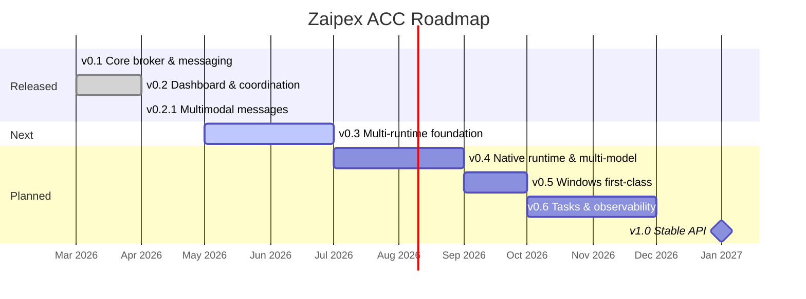

# Roadmap

> 🇪🇸 Plan público de Zaipex ACC. Lo mantenemos aquí porque queremos que
> cualquiera pueda ver hacia dónde va el proyecto y opinar antes de que
> algo llegue a `main`.
>
> 🇬🇧 Public plan for Zaipex ACC. We keep it here so anyone can see where
> the project is heading and weigh in before anything lands on `main`.

El progreso granular vive en [**Milestones**](https://github.com/Zaipex-Labs/agent-control-center/milestones). Este documento es la narrativa de alto nivel — por qué estamos haciendo lo que estamos haciendo.

🇬🇧 English

Granular progress lives in [**Milestones**](https://github.com/Zaipex-Labs/agent-control-center/milestones). This document is the high-level narrative — why we are doing what we are doing.

---

## Vista general / Overview

---

## Filosofía / Philosophy

🇪🇸

- **Localhost first.** Nada de servidores remotos. Todo corre en tu máquina, punto.
- **Cero lock-in al modelo.** Hoy dependemos de Claude Code CLI. Esto va a cambiar — el equipo debe poder usar Claude, GPT, Gemini, modelos locales (vía Ollama / llama.cpp) o una mezcla, sin que el broker se entere.
- **Node only en runtime.** Sin Python ni Bash como dependencias. El wrapper Python actual de PTY es temporal.
- **Agnóstico de agente.** Claude Code es el primer runtime, no el único. Queremos también Gemini CLI, Codex, Aider, y un runtime nativo propio.

🇬🇧

- **Localhost first.** No remote servers. Everything runs on your machine, period.
- **Zero model lock-in.** Today we depend on Claude Code CLI. That will change — teams should be able to mix Claude, GPT, Gemini, local models (via Ollama / llama.cpp) or any combination, with the broker staying agnostic.
- **Node only at runtime.** No Python or Bash dependencies. The current Python PTY wrapper is temporary.
- **Agent-agnostic.** Claude Code is the first runtime, not the only one. We also want Gemini CLI, Codex, Aider, and a native runtime of our own.

---

## Versiones / Versions

### ✅ v0.1 — Core broker & messaging *(released)*

🇪🇸 Broker HTTP en 127.0.0.1 con SQLite, MCP server por agente, CLI `acc`, estado compartido, historial persistente. La base sobre la que se construye todo.

🇬🇧 HTTP broker on 127.0.0.1 with SQLite, per-agent MCP server, `acc` CLI, shared state, persistent history. The foundation everything else is built on.

---

### ✅ v0.2 — Dashboard & coordination *(released — Apr 2026)*

🇪🇸 Dashboard web en vivo, tech lead permanente por proyecto, avatares generativos, reconexión automática, status line en tiempo real por agente, i18n (ES/EN), hilos de conversación con juntas colapsables, 300+ tests.

🇬🇧 Real-time web dashboard, permanent tech lead per project, generative avatars, auto-reconnect, live status line per agent, i18n (ES/EN), conversation threads with collapsible coordination meetings, 300+ tests.

---

### ✅ v0.2.1 — Multimodal messages *(released — Apr 2026)*

🇪🇸 Los agentes dejaron de hablar sólo en texto. Pueden intercambiar imágenes y archivos genéricos con dedup por SHA256, lightbox branded, composer con attach + drag-and-drop, y fallback textual para runtimes no-multimodales. Reference counting + GC al arranque limpian los blobs huérfanos. 353 tests.

🇬🇧 Agents are no longer text-only. They can exchange images and generic files with SHA256 dedup, branded lightbox, composer with attach + drag-and-drop, and textual fallback for non-multimodal runtimes. Reference counting + startup GC clean up orphan blobs. 353 tests.

---

### 🚧 v0.3 — Multi-runtime foundation

🇪🇸

**Objetivo**: desacoplar el broker de Claude Code. Cualquier agente compatible con MCP debería poder unirse al equipo.

- [ ] Abstraer una interfaz `AgentRuntime` sobre lo que hoy es "lanza `claude` con flags". Los detalles de cómo se levanta un agente quedan detrás de esa interfaz.
- [ ] Adaptador para **Gemini CLI** como segundo runtime de referencia — valida que la abstracción es real, no teórica.
- [ ] Adaptador para **OpenAI Codex** / Aider.
- [ ] Selector de runtime por agente en el dashboard (hoy solo hay selector de modelo, no de runtime).
- [ ] Contratos tipados para el estado compartido — dejar de usar `value: any` en `set_shared` / `get_shared`.

🇬🇧

**Goal**: decouple the broker from Claude Code. Any MCP-compatible agent should be able to join the team.

- [ ] Abstract an `AgentRuntime` interface over what is today "spawn `claude` with flags". How an agent boots lives behind that interface.
- [ ] **Gemini CLI** adapter as the second reference runtime — validates the abstraction is real, not theoretical.
- [ ] **OpenAI Codex** / Aider adapter.
- [ ] Per-agent runtime picker in the dashboard (currently only a model picker exists, not a runtime picker).
- [ ] Typed contracts for shared state — stop using `value: any` in `set_shared` / `get_shared`.

---

### 🔜 v0.4 — Native runtime & multi-model

🇪🇸

**Objetivo**: dejar de depender de CLIs externas. Podemos hablar directo con los providers.

- [ ] **Runtime nativo propio** con `@anthropic-ai/sdk`, `openai`, `@google/generative-ai` y `ollama`. Sin spawn de procesos externos — los agentes viven dentro del proceso Node.
- [ ] Tool-use vía MCP sigue funcionando exactamente igual. El broker no se entera de qué runtime usa cada agente.
- [ ] Tracking de tokens y costo por agente, visible en el dashboard.
- [ ] Caché automático de contexto — el broker ya sabe qué cambió en la shared state, podemos hidratar los prompts sin volver a mandar todo.
- [ ] Switch en caliente: cambiar de modelo sin reiniciar el agente.

🇬🇧

**Goal**: stop depending on external CLIs. Talk directly to providers.

- [ ] **Native runtime** built on `@anthropic-ai/sdk`, `openai`, `@google/generative-ai`, and `ollama`. No spawning external processes — agents live inside the Node process.
- [ ] MCP tool-use keeps working exactly the same. The broker doesn't need to know which runtime each agent uses.
- [ ] Per-agent token and cost tracking, visible in the dashboard.
- [ ] Automatic context caching — the broker already knows what changed in shared state, so we can hydrate prompts without resending everything.
- [ ] Hot model swap: change model without restarting the agent.

---

### 🔜 v0.5 — Windows first-class

🇪🇸

**Objetivo**: Windows deja de ser "usa WSL2" y se vuelve soporte de primera clase.

- [ ] Reemplazar `pty-wrap.py` por [`node-pty`](https://github.com/microsoft/node-pty). Node puro, sin Python en el PATH.
- [ ] Estrategia de spawn con **Windows Terminal** y PowerShell (ya hay un stub en `spawn.ts`; terminarlo y pulirlo).
- [ ] Añadir `windows-latest` a la matriz de CI (ubuntu, macos, windows × Node 20/22).
- [ ] Paths cross-platform en todo `src/shared/config.ts` (actualmente asume POSIX).
- [ ] Instalador: publicar a **winget** y/o **scoop** además de npm.

🇬🇧

**Goal**: Windows goes from "use WSL2" to first-class support.

- [ ] Replace `pty-wrap.py` with [`node-pty`](https://github.com/microsoft/node-pty). Pure Node, no Python on the PATH.
- [ ] **Windows Terminal** + PowerShell spawn strategy (stub already exists in `spawn.ts`; finish and polish it).
- [ ] Add `windows-latest` to the CI matrix (ubuntu, macos, windows × Node 20/22).
- [ ] Cross-platform paths everywhere in `src/shared/config.ts` (currently POSIX-ish).
- [ ] Installer: publish to **winget** and/or **scoop** alongside npm.

---

### 💭 v0.6 — Tasks & observability

🇪🇸

**Objetivo**: entender qué está haciendo el equipo sin tener que leer el chat.

- [ ] Sistema de tasks integrado: un agente puede crear una task, asignarla, y los demás la ven en el dashboard con estado (`pending`, `doing`, `done`, `blocked`).
- [ ] Métricas: tokens por agente, latencia de respuesta, mensajes por minuto, % de uptime.
- [ ] Webhooks salientes para integraciones (Slack, Discord, Linear, GitHub).
- [ ] Export del historial a Markdown / JSON para retrospectivas.

🇬🇧

**Goal**: understand what the team is doing without reading the chat.

- [ ] Integrated task system: an agent creates a task, assigns it, and others see it in the dashboard with status (`pending`, `doing`, `done`, `blocked`).
- [ ] Metrics: tokens per agent, response latency, messages per minute, uptime %.
- [ ] Outgoing webhooks for integrations (Slack, Discord, Linear, GitHub).
- [ ] Export history to Markdown / JSON for retrospectives.

---

### 🎯 v1.0 — Stable API

🇪🇸

**Objetivo**: podemos prometer semver. La gente puede montar herramientas encima sin miedo a que se rompa.

- [ ] API del broker congelada y documentada (OpenAPI / JSON Schema).
- [ ] Formato del SQLite congelado, con migraciones versionadas.
- [ ] Sistema de plugins: runtimes y webhooks se instalan como paquetes externos.
- [ ] **Publicación en npm** como `@zaipex-labs/acc` con `prepublishOnly` real.
- [ ] Sitio de documentación dedicado (Docusaurus o Nextra).
- [ ] Auditoría de seguridad externa.

🇬🇧

**Goal**: we can commit to semver. People can build tools on top without fear of breaking changes.

- [ ] Frozen and documented broker API (OpenAPI / JSON Schema).
- [ ] Frozen SQLite schema with versioned migrations.
- [ ] Plugin system: runtimes and webhooks installable as external packages.
- [ ] **Publish to npm** as `@zaipex-labs/acc` with a real `prepublishOnly`.
- [ ] Dedicated documentation site (Docusaurus or Nextra).
- [ ] External security audit.

---

## Cómo contribuir al roadmap / How to weigh in

🇪🇸

- **¿Tienes una idea?** Abre un [*Feature request*](https://github.com/Zaipex-Labs/agent-control-center/issues/new?template=feature_request.yml). Si encaja con alguna fase lo movemos al milestone.
- **¿Quieres construir algo de esto?** Comenta en el issue del milestone para coordinar, y manda un PR contra `main`. Guía completa en [`CONTRIBUTING.md`](CONTRIBUTING.md).
- **¿Algo no cuadra?** Las prioridades cambian. Si crees que algo debería ir antes o después, ábrelo como discussion y argumenta. Este documento no está grabado en piedra.

🇬🇧

- **Got an idea?** Open a [*Feature request*](https://github.com/Zaipex-Labs/agent-control-center/issues/new?template=feature_request.yml). If it fits a phase we'll move it to the matching milestone.
- **Want to build some of this?** Comment on the milestone's anchor issue to coordinate, and send a PR against `main`. Full guide in [`CONTRIBUTING.md`](CONTRIBUTING.md).
- **Something doesn't fit?** Priorities change. If you think something should come sooner or later, open a discussion and make the case. This document is not set in stone.
